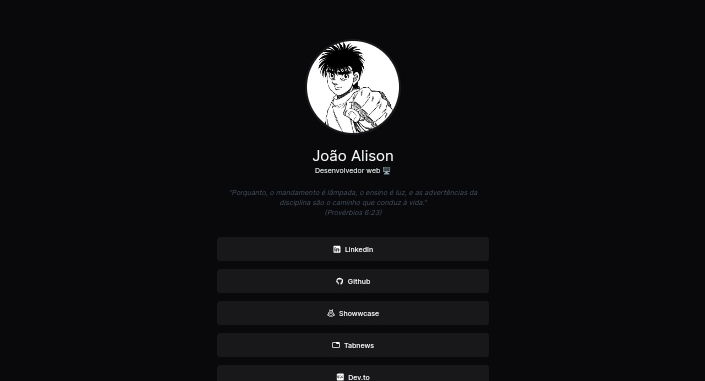

<h2 align="center">My Profile Links</h2>

<p align="center">
A mini project developed with the aim of bringing together some of the links that I consider important for my profile in 2024 👤🌐.
<br/>
</p>

- [Overview](#overview)
  - [About project](#about)
  - [Screenshots](#screenshots)
  - [Links](#links)
- [My process](#my-process)
  - [Built with](#technologies)
  - [Continued development](#continued-development)
  - [Useful resources](#useful-resources)
- [Author](#author)


</br>

## Overview
### About
I started developing My Profile Links during the end of 2023, initially I had in mind to do a small project to test the Shadcn ui as well as my knowledge in React + TS (It's always good to sharpen the ax 😅). So I thought about "recreating" an old project made with HTML/CSS that brought together contact links (Like Linktree) but now made with new technologies. 

I already had the structure in mind so I just looked for colors that were pleasant to me and that wouldn't bother the visitor too much (This was the most challenging part). 

I used Shadcn ui to create the buttons and the profile component (Shadcn ui uses Tailwind CSS to do styling so it was very good to test), to display the buttons I used an Array of objects to better organize the information for each button. 

This was another project developed for my portfolio, developed on my cell phone 📲 (I don't have a computer at the moment...).

### Screenshots
<p align="center">
  
</p>

### Links
- [Access the fineshed project, online ☁️](https://my-profile-links.vercel.app/)

</br>

## My process
### Technologies
### ⚙️👨‍💻
This project was built with the following technologies:

- React.js + Vite.js
- Typescript
- Tailwind CSS
- Shadcn ui
- Git/Github

### Continued development
I intend to add the dark/light mode to the project for those who prefer a light mode so it is possible to change it.

### Useful resources
### Running the Project Locally

Make sure you have the following requirements installed on your machine:

- Node.js (LTS version is recommended)
- npm (usually installed with Node.js)
- Git

Installation steps:

1. Clone this repository to your local machine:

   ```bash
   git clone https://github.com/JoaoAlisonTI/my-profile-links.git
   ```

2. Navigate to the project directory:

   ```bash
   cd my-profile-links
   ```

3. Install project dependencies:

   ```bash
   npm install
   ```

Running the project:

After installing all dependencies, you can start the local development server:

```bash
npm run dev
```

---

- [Node.js](https://nodejs.org/en) - Node.js® is a free, open-source, cross-platform JavaScript runtime environment that lets developers create servers, web apps, command line tools and scripts.

- [Vite - Next Generation Frontend Tooling](https://vitejs.dev/) - Vite.js is a JavaScript framework and build tool that aims to speed up and simplify the front-end development process for web applications. It was created by Evan You, the creator of Vue.js, and is designed to be platform-agnostic.

- [React.js](https://react.dev/) - The library for web and native user interfaces.

- [Shadcn ui](https://ui.shadcn.com/) - Beautifully designed components that you can copy and paste into your apps. Accessible. Customizable. Open Source.

- [Tailwind CSS](https://tailwindcss.com/) - A utility-first CSS framework packed with classes like flex, pt-4, text-center and rotate-90 that can be composed to build any design, directly in your markup.

- [TypeScript Array of Object](https://www.dhiwise.com/post/mastering-typescript-array-of-object-a-comprehensive-guide) - Mastering TypeScript Array of Object: A Comprehensive Guide.

## Author
*JoaoAlisonTI 👨🏽‍💻*

---

<strong>2024</strong>